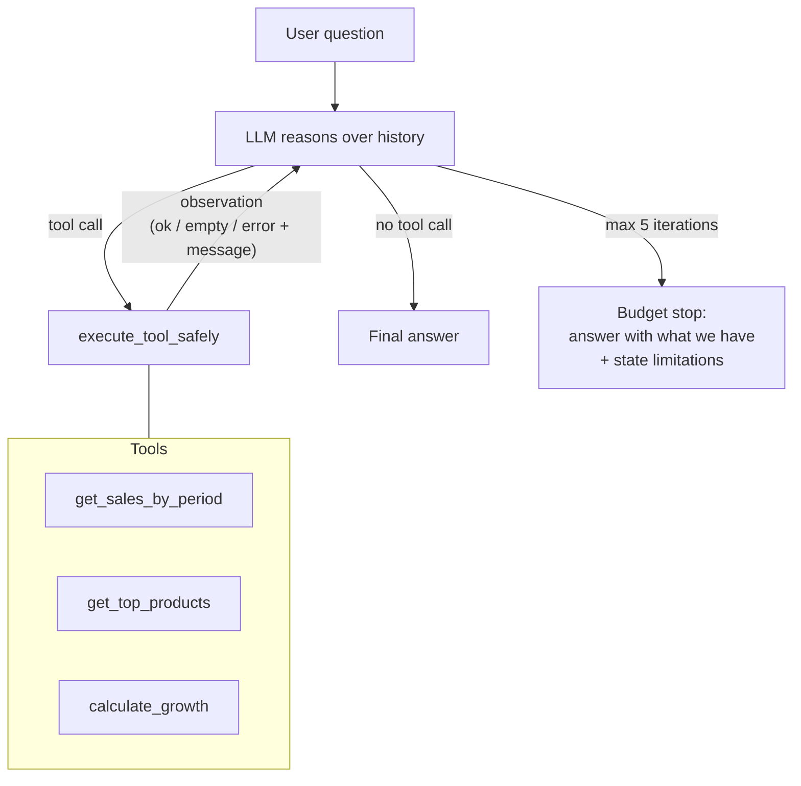

# Sales Analysis Agent

> An AI agent that answers business questions about retail sales data (phones, accessories, home electronics) using the **ReAct pattern** (reason → act → observe → repeat) with custom analysis tools.
>
> 🎓 Student portfolio project — built from scratch to learn AI agent engineering fundamentals: planning loops, tool design, stopping conditions, and failure handling. **Not a production system by design** — see [docs/design.md](docs/design.md) for the reasoning behind every scope decision.

**Status: ✅ Implemented** — tools + ReAct loop complete, tool layer verified against real data ([tests/test_cases.md](tests/test_cases.md)). Live LLM run requires an `ANTHROPIC_API_KEY`.

*[Ringkasan Bahasa Indonesia di bagian bawah ⬇](#ringkasan-bahasa-indonesia)*

---

## What it does

Given a natural-language business question, the agent decides which analysis tools to call, observes the results, and iterates until it can give a grounded answer — no hallucinated numbers.

Example questions it is designed to answer:

- *"Why did phone sales drop this month compared to last month?"*
- *"Which category performs best — by transaction count or by revenue?"* (ambiguous on purpose — the agent answers **both** interpretations explicitly)
- *"Compare May vs June performance across all categories"*

## Architecture



Key design decisions (full reasoning in [docs/design.md](docs/design.md)):

| Decision | Choice | Why |
|---|---|---|
| Planning loop | Single ReAct loop, no planner-executor split | Action space is small (3 tools); loop complexity should match action space |
| Stopping | Natural stop + budget stop (5 iters) + uncertainty stop | Prevents infinite loops; forces honest "I don't know" |
| Tool errors | Structured results `{status, data, message}`, never raw exceptions | The LLM is the consumer — descriptive errors are *actionable observations* it can self-correct from |
| Ambiguity | Answer all cheap interpretations, labeled explicitly | Cheaper than a clarification round-trip; silent assumptions are the worst option |

## Dataset

Synthetic retail sales data: **793 transactions, April–June 2026**, 3 categories (HP / Aksesoris / Elektronik Rumah). Columns: `date`, `category`, `product_name`, `unit_price`, `quantity`, `total_amount`. See [data/README.md](data/README.md).

## Project structure

```
sales-analysis-agent/
├── README.md              ← you are here
├── requirements.txt
├── .env.example           ← copy to .env, add your API key
├── data/                  ← sales_data.csv (synthetic)
├── docs/
│   └── design.md          ← design decisions & reasoning (ID)
├── scripts/
│   └── generate_data.py   ← seeded synthetic data generator
├── src/
│   ├── tools.py           ← 3 analysis tools + safe execution layer
│   └── agent.py           ← ReAct planning loop
└── tests/
    └── test_cases.md      ← 5 manual test scenarios incl. failure modes
```

## Getting started

```bash
git clone https://github.com/arif-mufti-tharsa/sales-analysis-agent.git
cd sales-analysis-agent
python -m venv .venv && .venv\Scripts\activate   # Windows
pip install -r requirements.txt
copy .env.example .env                            # then add your API key
python -m src.agent "Bandingkan performa Mei vs Juni untuk semua kategori"
```

## Roadmap

- [x] Design: planning loop, stopping conditions, fallback strategy ([docs/design.md](docs/design.md))
- [x] Repo scaffold + documentation
- [x] Implement 3 tools with structured error handling (`src/tools.py`)
- [x] Implement ReAct loop (`src/agent.py`)
- [x] Generate synthetic dataset (`scripts/generate_data.py`, seeded & reproducible)
- [x] Dry-run the 5 test scenarios against real data (`tests/test_cases.md`)
- [ ] Live LLM run with API key + record real transcripts

## Example output (dry-run)

**Q:** *"Kenapa penjualan HP turun bulan Juni dibanding Mei?"*

```
[iter 1] calculate_growth({"product": "HP", "period1": ["2026-05-01","2026-05-31"],
         "period2": ["2026-06-01","2026-06-30"]}) -> ok
[iter 2] get_sales_by_period({"start_date": "2026-06-01", "end_date": "2026-06-30"}) -> ok
```

> Penjualan HP turun **38,4%** (Rp 810,4 jt → Rp 498,9 jt), dengan jumlah transaksi
> turun dari 105 ke 58. Kategori lain relatif stabil (Aksesoris -10%, Elektronik
> Rumah -2%), jadi penurunan spesifik ke volume unit HP — bukan tren toko keseluruhan.

More scenarios — including error handling, typo self-correction ("iPhone 99" → "iPhone 15"), and ambiguity handling — in [tests/test_cases.md](tests/test_cases.md).

## What I learned

Structured tool errors (`{status, data, message}`) turned every failure into an observation the agent can act on: an out-of-range date returns the valid range, a typo returns "did you mean" suggestions. The empty-dict bug found during manual testing was the origin of this design — see [docs/design.md](docs/design.md) #3.

---

## Ringkasan (Bahasa Indonesia)

**Sales Analysis Agent** adalah AI agent yang menjawab pertanyaan bisnis atas data penjualan toko elektronik & HP (data sintetis, 793 transaksi, April–Juni 2026) menggunakan pola **ReAct**: LLM bernalar → memanggil tool analisis → mengamati hasil → mengulang sampai bisa menjawab dengan angka yang benar-benar berasal dari data.

Tiga tool yang tersedia: `get_sales_by_period` (total penjualan per periode), `get_top_products` (ranking produk terlaris), dan `calculate_growth` (persentase perubahan antar periode).

Prinsip desain utama: **kompleksitas loop mengikuti ruang aksi** (3 tools = 1 loop sederhana, tanpa framework berat), **error tool diperlakukan sebagai observasi** yang deskriptif supaya agent bisa mengoreksi diri, dan **pertanyaan ambigu dijawab dari semua interpretasi yang murah** alih-alih berasumsi diam-diam. Penjelasan lengkap setiap keputusan ada di [docs/design.md](docs/design.md).

Proyek ini adalah bagian dari roadmap belajar saya: Data Science → MLOps → **AI Agent Engineering**.

---

**Author:** Arif Mufti Tharsa — Computer Science undergraduate, Universitas Pertamina · [GitHub](https://github.com/arif-mufti-tharsa)
